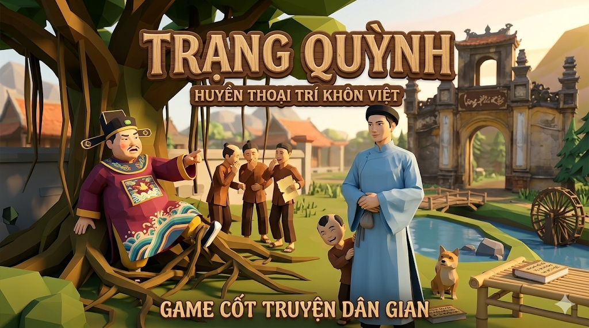
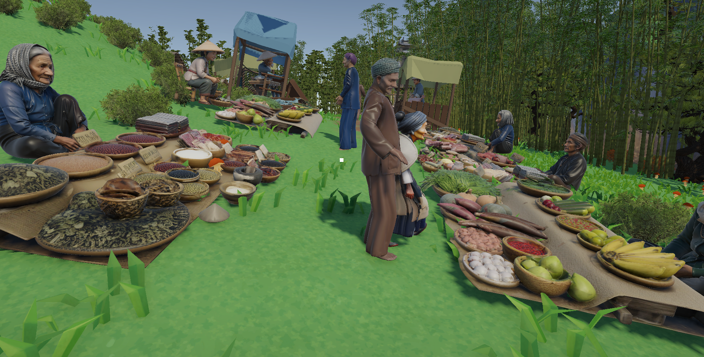
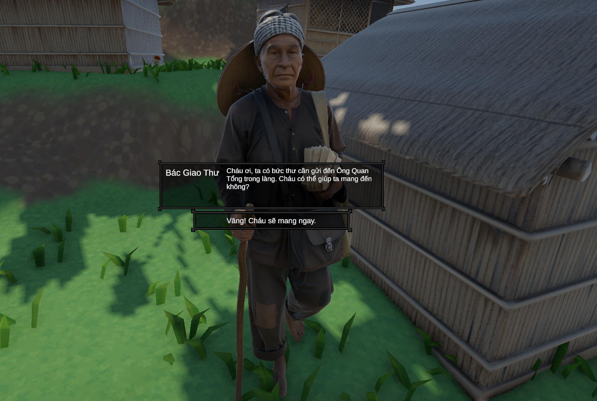
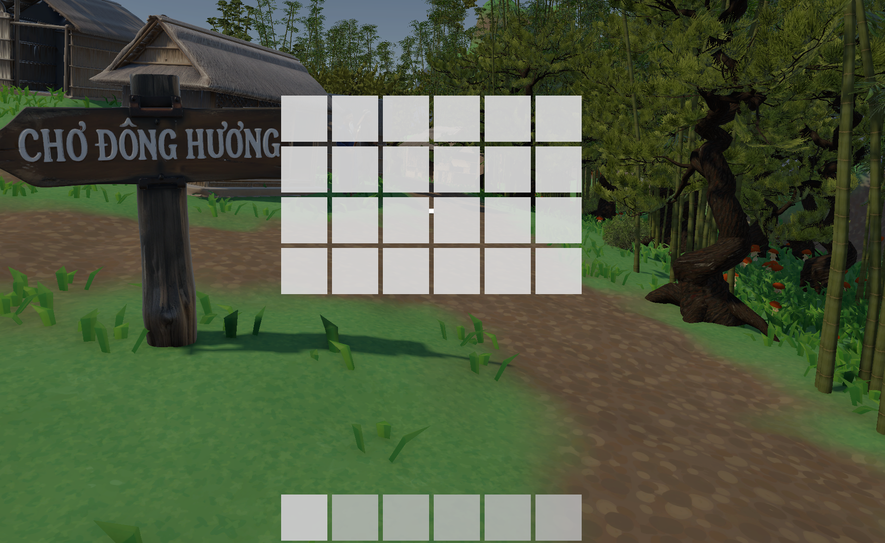

# Trang Quynh Game

> A 3D adventure game inspired by Vietnamese folklore, built with Unity and C#.

## Overview

**Trang Quynh Game** is a Unity 3D adventure project that combines exploration, NPC interaction, quest progression, inventory systems, and a traditional Vietnamese mini-game inside one gameplay loop.

The project was built to demonstrate practical gameplay programming skills, including:

- Quest state management
- NPC dialogue flow and interaction triggers
- Inventory and hotbar systems
- UI-driven mission tracking
- Mini-game integration into the main game loop
- AI difficulty design for a turn-based board game

This repository is suitable for showcasing gameplay programming, UI logic, mission flow design, and system integration in a portfolio.

## Demo

### Gameplay Video

[](https://your-video-link-here)

### Screenshots

Representative screenshots of the environment, dialogue system, inventory flow, and mini-game will be added here.

Markdown template:
| Environment | NPC Dialogue |
|---|---|
|  |  |

| Inventory System | O An Quan Mini-game |
|---|---|
|  |  |

| Mission Progress |
|---|
|  |

### GIFs or Short Clips

Short gameplay clips will be added here to showcase mission flow, item interaction, and O An Quan transitions.

### Accepting a Quest


### Inventory Update


### Mini-game Launch


## Project Highlights

- Built a **quest-driven adventure flow** with multiple NPC missions and reward-based progression.
- Implemented **branching dialogue interactions** using trigger-based NPC conversations.
- Developed an **inventory and hotbar system** with item pickup, stacking, drag-and-drop, equip, and drop interactions.
- Integrated the traditional Vietnamese board game **O An Quan** as a playable in-game challenge.
- Added **multiple AI difficulty levels** for the mini-game, including Random, Greedy, and Minimax with alpha-beta pruning.
- Designed supporting systems such as **tutorial**, **undo**, **achievement tracking**, **level/XP progression**, and **currency rewards**.

## Gameplay Features

### Main Adventure Systems

- Explore a 3D environment inspired by Vietnamese rural and market settings
- Interact with NPCs through proximity-based dialogue triggers
- Accept, track, and complete missions through dialogue events and state transitions
- Collect, carry, and deliver items required to complete quests
- Earn gold through mission completion and progress toward level completion

### Quest Systems

The current project includes multiple mission flows, such as:

- Collecting required items and returning them to an NPC
- Delivering a letter between NPCs
- Completing item-based mission objectives through inventory checks
- Challenging an NPC through a mini-game and receiving rewards based on the result

### Mini-game: O An Quan

The project features a playable **O An Quan** mini-game connected directly to the main adventure gameplay:

- Triggered through an NPC challenge flow
- Launches from the main world after dialogue confirmation
- Returns win/lose results back to the main game
- Rewards the player on victory and allows retry on defeat
- Supports AI difficulty selection and turn-based interaction

## Technical Highlights

### Quest and Conversation Architecture

- Quest logic is handled through dedicated mission controllers such as:
  - `Mission1Controller`
  - `Mission2Controller`
  - `Mission2TurnInController`
  - `Mission3Controller`
  - `Mission4OQuanController`
- NPC conversations are triggered through `ConversationStarter`
- Conversation flow can be dynamically overridden based on mission state using `IConversationOverrideProvider`
- Mission progress is reflected in UI through checklist panels and mission board tracking

### Inventory System

The inventory implementation supports:

- Item pickup from the 3D world
- Item stacking
- Drag-and-drop between inventory slots
- Hotbar selection
- Equipped hand item display
- Item dropping back into the world
- Tooltip-style item description UI

### Mini-game AI

The O An Quan mini-game includes several AI strategies:

- **Easy:** Random AI
- **Medium:** Greedy AI
- **Hard:** Minimax AI with alpha-beta pruning

Additional systems include:

- Board state pooling to reduce unnecessary allocations
- Undo support through stored game state snapshots
- Achievement and progression systems backed by `PlayerPrefs`

## My Role

**Role:** Game Developer

Key responsibilities demonstrated in this project:

- Built gameplay systems in C# for quests, inventory, mission flow, and UI behavior
- Integrated NPC conversations with mission states and reward logic
- Connected the main adventure game with the O An Quan mini-game using result callbacks
- Implemented and maintained AI behavior and supporting systems for the mini-game
- Designed user-facing gameplay feedback through checklist UI, dialogue flow, reward states, and progression systems

## Tech Stack

- **Engine:** Unity 6 (`6000.3.5f2`)
- **Language:** C#
- **Rendering:** URP
- **UI:** Unity UI / TextMeshPro
- **Input:** Unity Input System
- **Dialogue:** Dialogue Editor integration
- **Persistence:** PlayerPrefs
- **Additional Systems:** Cinemachine, navigation, video playback, mission UI, AI gameplay systems

## Controls

These are the main controls currently used by the project:

- `F`: Talk to NPC / start conversation
- `E`: Pick up item
- `Tab`: Open or close inventory
- `1-9`: Select hotbar slot
- `G`: Drop equipped item
- `Mouse`: UI interaction and mini-game interaction

## Getting Started

### Requirements

- Unity Editor `6000.3.5f2`

### Open the Project

1. Open the project with Unity Hub
2. Use Unity Editor version `6000.3.5f2`
3. Load one of the main scenes from Build Settings:
   - `Assets/Scenes/MainMenu/Prefabs/MainMenu.unity`
   - `Assets/Scenes/PlayScene.unity`

### Run

1. Open the main menu or gameplay scene
2. Press `Play` in the Unity Editor
3. Interact with NPCs, collect items, complete missions, and launch the O An Quan mini-game

## Download

A playable build link will be added here.

[Download Build](https://ngxtm.itch.io/trang-quynh-vn-game)

## Project Structure

```text
Assets/
├── Scripts/
│   ├── Conversation/
│   ├── Inventory/
│   ├── Mission/
│   ├── NPC/
│   └── Audio/
├── MiniGame/
│   └── Scripts/Client/
├── Scenes/
└── MoneyStatus/
```

## What This Project Demonstrates

This project does not only show a playable Unity scene. It demonstrates the ability to:

- Build gameplay features as reusable systems instead of one-off scripts
- Connect UI, dialogue, player actions, and world state into one coherent loop
- Design mission progression with clear state transitions
- Integrate a separate mini-game into a larger gameplay experience
- Implement game AI beyond basic rule scripting
- Create player feedback systems such as rewards, achievements, level progression, and mission tracking

<!--
Internal media checklist:
- Cover image: strongest village or market scene
- Trailer: 45-90 seconds
- Full walkthrough: 2-4 minutes
- Key screenshots: environment, NPC dialogue, inventory/hotbar, mission checklist, O An Quan board
- Short clips: quest acceptance, item pickup, mini-game launch, AI turn/result
- Optional: architecture image, code screenshot, build download link

Suggested media folder layout:
docs/
└── media/
    ├── cover/
    │   └── cover-main.png
    ├── screenshots/
    │   ├── environment-market.png
    │   ├── npc-dialogue.png
    │   ├── inventory-hotbar.png
    │   ├── o-an-quan-board.png
    │   └── mission-checklist.png
    └── gifs/
        ├── quest-accept.gif
        ├── inventory-update.gif
        ├── minigame-launch.gif
        └── ai-turn-result.gif

Quick fill order:
1. Add cover image
2. Add trailer link
3. Add 5 screenshots
4. Add 3 GIFs
5. Add downloadable build link
-->
